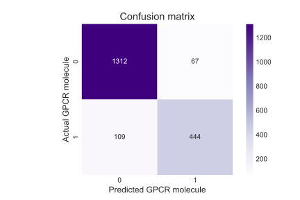

Classification module objectives:
- Evaluate different classification algorithms in terms of performance, interpretability, and complexity
- Apply hyperparameter tuning and feature engineering to increase classification model performane 

# Mechanism of action predictions based on molecular properties

Classified molecules as GPCR ligands based solely on molecular properties that were calculable via the chemoinformatics python packages.

|                     | Accuracy | Precision | Recall | F1 Score |
|---------------------|----------|-----------|--------|----------|
| KNN                 | 0.8037   | 0.6727    | 0.5895 | 0.6283   |
| Logistic Regression | 0.7329   | 0.6019    | 0.1520 | 0.2427   |
| Decision Tree       | 0.8223   | 0.7312    | 0.5833 | 0.6489   |
| Random Forests      | 0.89247  | 0.8522    | 0.7488 | 0.7971   |

Table: Comparison of classification algoithm performance

Tools used:
Sci-kitlearn, Statsmodel, biopython, mordred, rdkit, seaborn, matplotlib, pandas, imblearn

Databases accessed:
IUPHAR (Guide to Pharmacology), Pubchem, Uniprot

