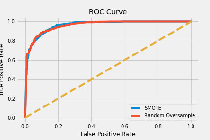

Metis Bootcamp - Classification Module

Minimal Viable Project

Emily Lorenzen

06/08/2021

# Minimum Viable Project

To create a model that can predict if a ligand binds to a GPCR or not, I evaluated the metrics of a logistic regression model, KNN, decision tree and random forests. Random forests performed the best for all metrics calculated - accuracy, precision, recall and F1. To account for sampling differences I used two over sampling methods - random oversampler and smote. Random oversampling increased all the metrics, expect recall, more than SMOTE. Below is an ROC graph for my random forest models with random oversampling and SMOTE. 

