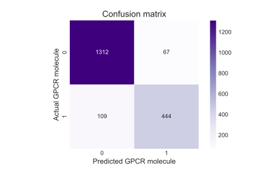

Metis Bootcamp - Classification

Emily Lorenzen

06/11/2021

# Classifying molecules as GPCR interactors

## Abstract

## Data
Data was obtained from the following sources:

 - [IUPHAR/Guide to Pharmacology](https://www.guidetopharmacology.org/download.jsp): complete ligand list, and ligand mapping list
 - [Pubchem](https://pubchem.ncbi.nlm.nih.gov/): chemical and physical properties of ligands
 - [Uniprot](https://www.uniprot.org/): protein target superfamily 

## Tools and Algorithms

#### Data acquisition and cleanup
In addition to pandas and numpy, the following python packages were used for data acquisition, cleanup, and feature engineering.

- pubchempy to access PubChem database
- rdkit to parse molecular descriptors
- mordred to calculate molecular features

#### Classification modeling and evaluation

Resampling and SMOTE were performed with the imblearn package.  Sklearn was used to fit data using several modeling algorithms - K nearest neighbors, logistic regression, and random forest. Evaluation of the models was performed with Sklearn. 

#### Data visualization

Matplotlib and seaborn were used for data visualization. 

## Results/Design

### Model selection
To begin with, I tested five different classification algorithms on data without feature engineering. Metrics from each model are presented in the table below. 

|                     | Accuracy | Precision | Recall | F1 Score |
|---------------------|----------|-----------|--------|----------|
| KNN                 | 0.8037   | 0.6727    | 0.5895 | 0.6283   |
| Logistic Regression | 0.7329   | 0.6019    | 0.1520 | 0.2427   |
| Decision Tree       | 0.8223   | 0.7312    | 0.5833 | 0.6489   |
| Random Forests      | 0.89247  | 0.8522    | 0.7488 | 0.7971   |
| Gradiant Boosted Trees| 0.0005 | 1.0000 | 1.0000 | 1.0000

Based on these metrics, random forests performs the best out of the models tested. 

### Oversampling

I then applied two oversampling techniques to account for class imbalances, resampling and SMOTE. Metrics from oversampling are presented in the table below. 

|            | Accuracy | Precision | Recall | F1 Score |
|------------|----------|-----------|--------|----------|
| None       | 0.8927   | 0.8522    | 0.7488 | 0.7971   |
| Resampling | 0.9063   | 0.8450    | 0.8316 | 0.8382   |
| SMOTE      | 0.8929   | 0.7902    | 0.8617 | 0.8244   |

### Feature Engineering

Next, I added some features to my dataset by normalizing TPSA, complexity, H bond acceptors, H bond donors to the molecular weight. 

### Model Evaluation

To evaluate the model I first plotted an ROC graph.

Figure 1: ROC curve showing the performance of the classification model chosen at all classification thresfolds

I then plotted the relative importance of the features. Several of the features I expected to play the most importance, and therefore were a part of the feature engineering were within the top features. These included Hbondacceptorcount_mass, TPSA_mass, complexity_mass, and heavyatomcount_mass. One feature I did not expect to see within the top was rotatablebondcount so I'll have a think about that later. 

Figure 2: Relative importance of each feature to the development of the classification model

I then plotted the confusion matrix at a probability threshold of 0.5 to determine the number of false negatives and false positives. 

Fig 3: Confusion matrix of classification model when threshold is set to .5

I then determine the threshold level to set my recall to >.95 and plotted the resulting confusion matrix. 

Fig 4: Confusion matrix of classification model when threshold is set to .16

## Communication 
Results were presented on June 11, 2021 to colleagues in the Metis data science bootcamp. Code is available is at https://www.github.com/emilylorenzen/metis-classification1